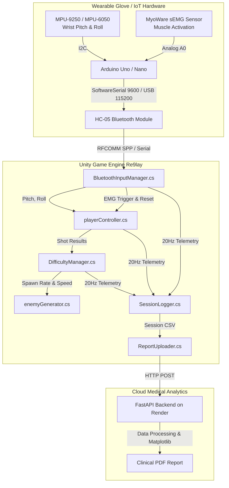

# 🚀 Re9lay — Gamified IoT Neuro-Rehabilitation System

<div align="center">


**Transforming upper-limb physical rehabilitation into an engaging, biofeedback-driven 2D space shooter powered by wearable IMU and sEMG sensors.**

</div>

---

## 📖 Overview

Traditional upper-extremity physical therapy after stroke, spinal cord injury, or orthopedic surgery often involves repetitive, tedious exercises leading to low patient adherence and subjective clinical evaluations. 

**Re9lay** is an IoT-enabled gamified rehabilitation platform that bridges interactive gaming with clinical neuro-rehabilitation:
* **Wearable Sensor Glove / Wristband:** An Arduino equipped with an **MPU-9250** (9-DOF IMU) and **MyoWare 2.0 / Surface EMG** captures wrist kinematics and muscle contractions in real time.
* **Biofeedback Gameplay:** Real-time wrist pitch and roll kinematics steer the player's spacecraft relative to an auto-calibrated neutral resting baseline, while active muscle contractions fire defensive lasers.
* **Clinically-Safe Dynamic Difficulty Adaptation (DDA):** An automated clinical algorithm tracks patient accuracy across a 10-shot rolling window, progressively adjusting target speed and spawn frequency without causing patient fatigue or frustration.
* **Cloud Telemetry & PDF Medical Reports:** High-resolution 20Hz session data is streamed and uploaded to a cloud-based **FastAPI** service on Render, generating downloadable PDF clinical analytics for therapists.

---

## 🌟 Key Features

### 🎮 1. Kinematic Spatial Navigation & Neutral Auto-Calibration (MPU-9250 IMU)
* **Automatic 2-Second Neutral Baseline Calibration:** At the start of each rehabilitation session, the system automatically records the patient's resting hand position for ~2 seconds, computing reference baseline angles (`pitch0`, `roll0`) via circular mean averaging.
* **Relative Angular Displacements ($\Delta\text{Pitch}, \Delta\text{Roll}$):** Movement thresholds operate entirely on angular deltas from the calibrated rest posture ($\Delta\theta = \text{NormalizeAngle}(\theta - \theta_0)$), completely eliminating errors caused by sensor orientation shifts or variations in how the glove is worn:
  * **Horizontal Steering (Pitch Delta):** $\Delta\text{Pitch} > +30^\circ$ (Right), $\Delta\text{Pitch} < -30^\circ$ (Left).
  * **Vertical Steering (Roll Delta):** $\Delta\text{Roll} > +40^\circ$ (Up), $\Delta\text{Roll} < -40^\circ$ (Down).
* **Circular Wraparound Normalization:** Angles are wrapped to $[-180^\circ, +180^\circ]$, ensuring smooth navigation without glitches near the $\pm 180^\circ$ seam.
* **Simultaneous Diagonal Movement:** Pitch and roll are evaluated independently each frame, allowing responsive, normalized diagonal maneuvering.

### 💪 2. Neuromuscular Triggering & Relaxation Cycle (sEMG)
* **Single-Shot Firing:** Firing requires exceeding the muscle contraction threshold (e.g., EMG $> 450$).
* **Mandatory Relaxation Reset:** To prevent sustained spasticity and muscle fatigue, the player **must consciously relax the muscle** below the rest baseline before firing another shot.

### 🧠 3. Adaptive Difficulty Engine (DDA)
* **10-Shot Rolling Window:** Evaluates live hitting performance.
* **Progressive Challenge:** Achieving $\ge 80\%$ accuracy increases game pace by reducing alien spawn intervals ($5.0\text{s} \rightarrow 4.5\text{s} \rightarrow 4.0\text{s} \rightarrow 3.5\text{s} \rightarrow 3.0\text{s}$).
* **Clinical Safety Ceilings:** Minimum spawn interval clamped at $3.0\text{s}$ to avoid overwhelming the patient. Successful hits are protected and cannot trigger difficulty drops.

### 📊 4. High-Frequency 20Hz Telemetry & Cloud Reporting
* **Local Logging:** `SessionLogger.cs` logs timestamped kinematic angles, raw EMG amplitude, player coordinates, and hit/miss events at 20Hz to a local `.csv` file.
* **FastAPI Cloud Pipeline:** Upon session completion, the session log is automatically uploaded via multipart HTTP POST to our Render backend (`https://report-maker-re9lay.onrender.com`), generating an official clinical PDF report with recovery metrics.

---

## 🛠️ System Architecture



---

## 🔌 Hardware Wiring & Bill of Materials

### Bill of Materials (BOM)
| Component | Function | Interface |
| :--- | :--- | :--- |
| **Arduino Uno / Nano** | Microcontroller unit | USB / 5V Power |
| **MPU-9250 / MPU-6050** | 9-DOF / 6-DOF Inertial Measurement Unit | I2C (SDA, SCL) |
| **MyoWare 2.0 / sEMG** | Surface Electromyography Sensor | Analog (A0) |
| **HC-05** | Bluetooth SPP 2.0 Module | UART (Pins 10, 11) |
| **Resistors (1kΩ, 2kΩ)** | Voltage divider for HC-05 RX (5V $\rightarrow$ 3.3V) | Breadboard / PCB |

### Pinout Table
| Module Pin | Arduino Pin | Description |
| :--- | :--- | :--- |
| **MPU VCC** | `5V` or `3.3V` | Power supply |
| **MPU GND** | `GND` | Common Ground |
| **MPU SDA** | `A4` (Uno) / `SDA` | I2C Serial Data |
| **MPU SCL** | `A5` (Uno) / `SCL` | I2C Serial Clock |
| **EMG SIG** | `A0` | Muscle signal analog input |
| **EMG GND** | `GND` | Reference Ground |
| **HC-05 VCC** | `5V` | Module power |
| **HC-05 GND** | `GND` | Common Ground |
| **HC-05 TX** | `Pin 10` (Arduino RX) | Bluetooth telemetry in |
| **HC-05 RX** | `Pin 11` (via 1k/2k divider) | Bluetooth telemetry out |

---

## 💻 Software Stack

* **Unity Engine:** 2D Physics, Parallax backgrounds, Custom Immediate GUI, Android JNI plugins.
* **Firmware:** Arduino C++ (`Firmware/NeuroPlay_Arduino.ino`).
* **Cloud Reporting:** Python 3.11, FastAPI, ReportLab, Matplotlib, Pandas, Render Cloud Hosting.
* **Communication Protocols:**
  * **Wireless:** Bluetooth Classic RFCOMM (SPP - Serial Port Profile) at **9600 baud**.
  * **Wired/Editor:** USB Serial CH340 / FTDI at **115200 baud**.
  * **Packet Format:** `Pitch,Roll,EMG\n` (e.g. `-1.07,0.99,251`).

---

## 📁 Project Structure

```text
├── Assets/
│   ├── Script/
│   │   ├── BluetoothInputManager.cs  # Cross-platform Bluetooth & Serial communication
│   │   ├── playerController.cs       # Player movement & single-shot relaxation logic
│   │   ├── DifficultyManager.cs      # 10-shot rolling-window DDA engine
│   │   ├── GUI.cs                    # Rehabilitation HUD, calibration & device scanning
│   │   ├── SessionLogger.cs          # 20Hz clinical CSV telemetry logger
│   │   ├── ReportUploader.cs         # Cloud sync & PDF report fetcher
│   │   ├── enemyGenerator.cs         # Alien spawner controlled by DDA
│   │   ├── alienScript.cs            # Enemy kinematics & collision detection
│   │   ├── laserScript.cs            # Player bullet logic & hit registration
│   │   └── GameSettings.cs           # Global threshold configuration
│   ├── Resources/
│   │   ├── main_menu_logo.png        # In-game branding
│   │   └── icon_logo.png             # Application logo
│   └── Sprites/                      # Spaceships, aliens, lasers, HUD assets
├── Firmware/
│   └── NeuroPlay_Arduino.ino         # Arduino MPU9250 & EMG sensor acquisition code
├── ProjectSettings/                  # Unity Android & PC player settings
└── README.md                         # Project documentation
```

---

## 🚀 Getting Started

### 1. Hardware Firmware Setup
1. Open [`Firmware/NeuroPlay_Arduino.ino`](Firmware/NeuroPlay_Arduino.ino) in the Arduino IDE.
2. Install required libraries via the Arduino Library Manager:
   * `MPU9250` (or `MPU6050`)
   * `Wire` & `SoftwareSerial`
3. Connect your Arduino via USB, select your board and COM port, and click **Upload**.

### 2. Pairing the HC-05 Module
1. Power the wearable glove. The HC-05 LED will blink rapidly (2 Hz).
2. On your Android tablet/phone or PC:
   * Go to **Bluetooth Settings** $\rightarrow$ **Pair New Device**.
   * Select **`HC-05`** and enter PIN **`1234`** (or `0000`).

### 3. Running in Unity Editor (Development / Testing)
1. Open the project in **Unity 2022.3 LTS**.
2. Open `Assets/Scenes/Main.unity` (or your startup scene).
3. In the Hierarchy, select `_NeuroPlayManagers` $\rightarrow$ `BluetoothInputManager`:
   * **To play over USB Cable:** Set `Editor COM Port` to your Arduino's port (e.g., `COM7`) and `Baud Rate` to `115200`.
   * **To play over Bluetooth:** Set `Editor COM Port` to your Bluetooth outgoing port (e.g., `COM9`) and `Baud Rate` to `9600`.
   * **Keyboard Simulation Mode:** Check `Use Simulation` to test using **WASD** for movement and **Spacebar** for muscle contraction.
4. Click **Play**!

### 4. Building for Android
1. In Unity, go to **File** $\rightarrow$ **Build Settings...**
2. Switch platform to **Android**.
3. Under **Player Settings**:
   * Minimum API Level: **Android 8.0 (API level 26)**
   * Target API Level: **Android 13.0 / 14.0 (API level 33+)**
4. Connect your Android device via USB (with Developer Options & USB Debugging enabled) and click **Build and Run**.
5. When prompted on Android, grant **Nearby Devices / Bluetooth permissions**.
6. Select your paired **`HC-05`** from the in-game device list to begin therapy!

---

## 🎮 Gameplay Controls & Calibration

| Action | Sensor Control (Wearable Glove) | Keyboard Simulation |
| :--- | :--- | :--- |
| **Neutral Calibration** | **Hold hand at rest for ~2 seconds** at session start (`pitch0`, `roll0`) | Automatic baseline capture |
| **Move Left / Right** | Wrist Pitch tilt ($\Delta\text{Pitch} < -30^\circ$ Left, $\Delta\text{Pitch} > +30^\circ$ Right) | `A` / `D` or `Left` / `Right` |
| **Move Up / Down** | Wrist Roll tilt ($\Delta\text{Roll} > +40^\circ$ Up, $\Delta\text{Roll} < -40^\circ$ Down) | `W` / `S` or `Up` / `Down` |
| **Diagonal Steering** | Combine Pitch and Roll tilts simultaneously | Multi-key (e.g. `W`+`D`, `S`+`A`) |
| **Shoot Laser** | Contract forearm muscle (EMG $> \text{threshold}$) | `Spacebar` |
| **Reload / Ready** | **Consciously relax forearm muscle** below baseline | Release `Spacebar` |

---

## 📈 Clinical Telemetry & Reporting

During every rehabilitation session, `SessionLogger.cs` streams 20 data points per second:
```csv
Timestamp,GameTime,PlayerX,PlayerY,Pitch,Roll,EMG,IsContracted,Score,AlienCount,SpawnInterval,SpeedMultiplier
2026-09-06 23:24:12.102,1.20,0.00,-3.50,-1.07,0.99,251,False,0,1,5.0,1.0
2026-09-06 23:24:12.152,1.25,0.00,-3.50,-3.58,3.36,233,False,0,1,5.0,1.0
```

When the session concludes, the log is transmitted to the **Re9lay Cloud API**:
* **Endpoint:** `POST https://report-maker-re9lay.onrender.com/upload-session`
* **Outputs:** 
  * Patient Accuracy & Hit-Rate percentages.
  * Range of Motion (ROM) in wrist pitch & roll axes.
  * Muscle contraction latency, peak voluntary contraction, and fatigue curves.
  * Comprehensive PDF report for clinical records and insurance compliance.

---

## 👥 Contributors & Acknowledgments

* **Lead Developers & Researchers:** Re9lay Development Team
* **Base 2D Space Shooter Assets:** Inspired by classic arcade space shooter mechanics.
* **Faculty & Clinical Advisors:** Biomedical Engineering & Rehabilitation Robotics Labs.

---

<div align="center">
<b>Empowering Motor Recovery Through Play. 🚀</b>
</div>
